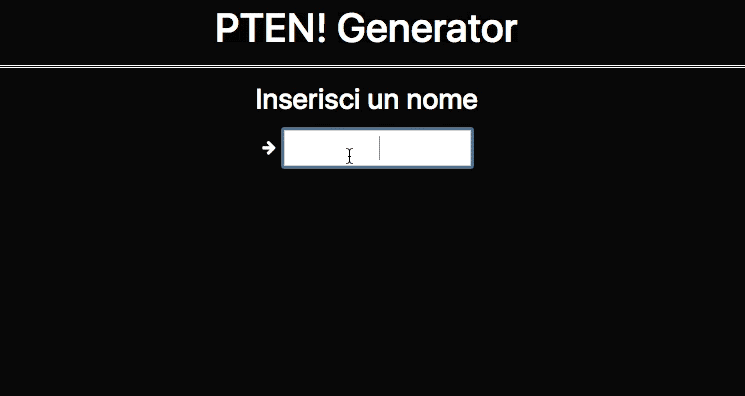
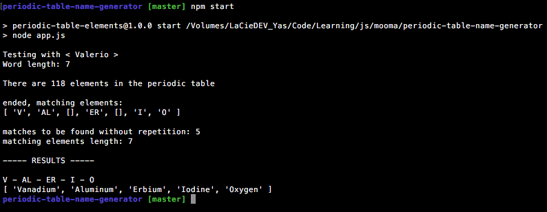

#PTENG!
###Periodic Table Elements Name Generator
===
A simple generator written in **nodejs** that reads a word in input and outputs the same word as composed by elements of the periodic table.

This repository contains the code and the data.

The file *periodic-table-of-elements.csv* was originally taken from:  [ http://www.data-explorer.com/data]( http://www.data-explorer.com/data) and then converted to *periodic-table-of-elements.json* .

A more updated version of the json with all the elements can be found on the awesome **Corpora** project by *Dariusk*, here: [https://github.com/dariusk/corpora/tree/master/data/science](https://github.com/dariusk/corpora/tree/master/data/science)

##Example output
###index.html

###node app

